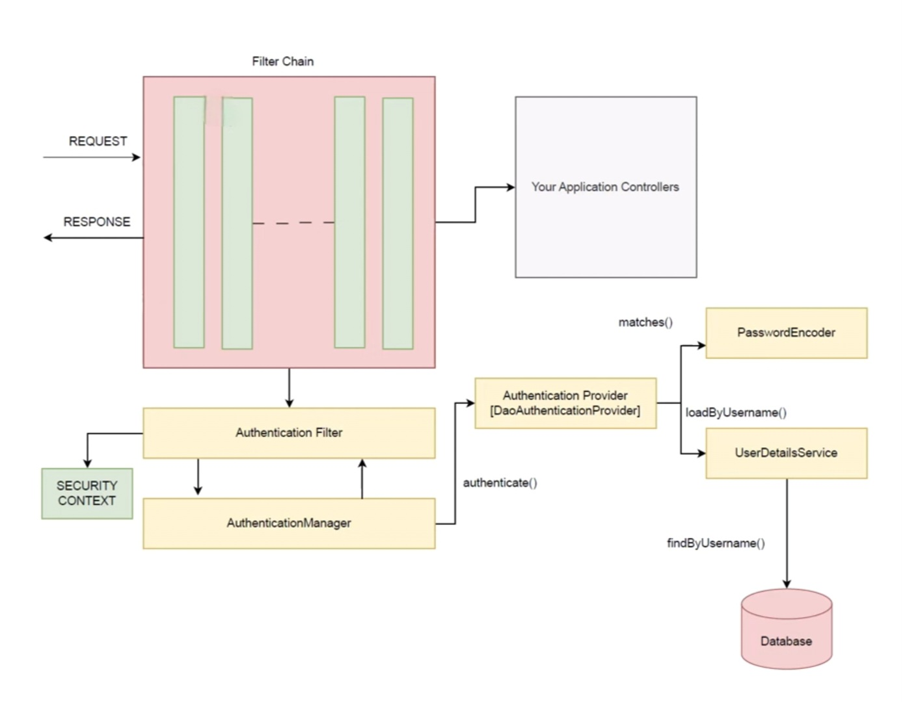
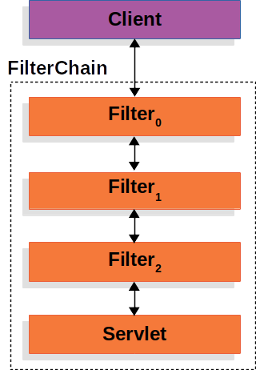
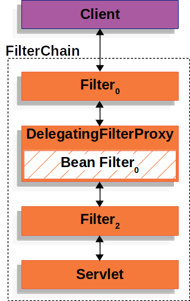
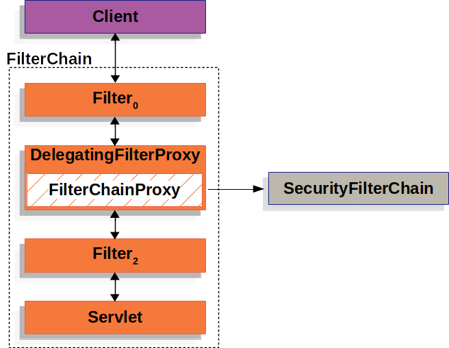
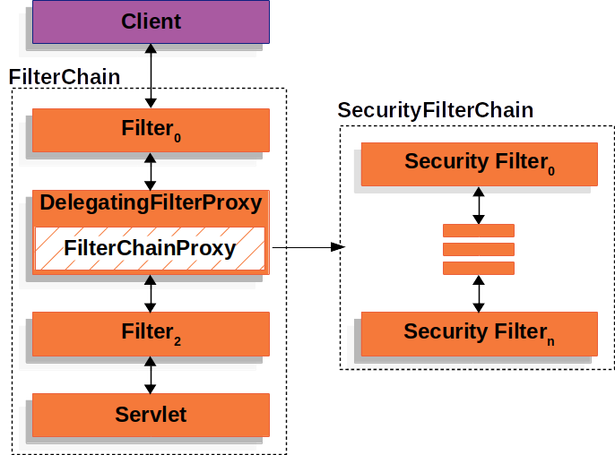
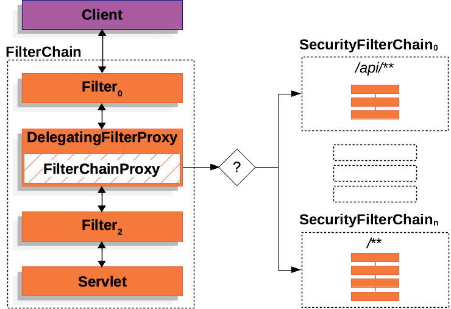

# Spring Security 6 Architecture



# 1. Filter Chain
A filter chain in Spring Security is a sequence of filters that process incoming requests according to defined security rules. These rules determine which endpoints require authentication, which ones require specific roles or authorities, and which endpoints are publicly accessible without authentication. Developers can customize and configure the filter chain to enforce the desired security policies for their application.



Spring Boot auto-registers a SecurityFilterChain bean. You can define multiple filter chains for different endpoints if needed.

Example: /api/** can have JWT-based filters, while /login uses form login.

# 2. Authentication Filter
This is creted by default- when we add spring security as dependency in our application


1. It intercepts the login request
2. The request header contains username, or password or any login credentials that needs to be validated
3. Authentication filter will grab these credentials and will create an ```Authentication``` object
4. Once the ```Authentication``` object is created, it is handed over to ```AuthenticationManager```.
5. ```AuthenticationManager``` after performing authentication sends fully populated ```Authentication``` object - with granted authoritites (obviously if authentication is successful) back to authentication filter
6. Now Authentication filter will store this updated, fully populated ```Authentication``` object in ```SecurityContext```.

Note:

By default, if we use formLogin(), Spring Security creates a UsernamePasswordAuthenticationFilter.

If we use JWT, you usually write your own custom filter (extending OncePerRequestFilter).

# 3. AuthenticationManager

```AuthenticatonManager``` now needs to ```authenticate()```. And for this, it needs an ```AuthenticationProvider```.


##### 3.1 What is ```AuthenticationManager()```?
- It is a functional interface
- It processes an ```Authentication``` request
- It has the method: ```Authentication authenticate(Authentication authentication)```
- Under the hood, this method uses AuthenticationProvider to authenticate
- This method attempts to authenticate the passed authentication object, returning a fully populated ```Authentication``` object (including granted authorities) if successful.
- This ```Authentication``` object is returned to ```AuthenticationFilter```
- This method throws ```AuthenticationException``` - if authentication fails.


# 4. AuthenticationProvider


##### 4.1 What is an AuthenticationProvider?
1.  See there are various ways of implementing authentication
    - Authentication based on credentials stored in DB
    - JWT based authentication
    - OneTimeToken based authentication
2. Now, Authentication Manager to perform ```authenticate()``` method, requires an AuthenticationProvider
3. AuthenticationProvider is an interface and therefore there are several known implementing classes
    - OneTimeAuthenticationProvider
    - JwtAuthenticationProvider
    - DaoAuthenticationProvider
    - RememberMeAuthenticationProvider
4. Once authentication is done by ```AuthenticationProvider```, it passes a fully populated ```Authentication``` object (including granted authorities), if successful.

##### 4.2 DaoAuthenticationProvider

It is responsible for checking whether the credentials stored in ```Authentication``` object are correct or not. To check if the credentials are valid or not, an ```AuthenticationProvider``` needs two things:
- ```PasswordEncoder```
- ```UserDetailsService```
- It checks user credentials using PasswordEncoder.matches(rawPassword, encodedPassword)
- It checks user credentials using PasswordEncoder.matches(rawPassword, encodedPassword)

# 5. UserDetailsService
If the authentication provider is ```DaoAuthenticationProvider```, 
##### 5.1: What is ```UserDetailsService```?
- It is a functional interface provided by Spring Security.
- This is the core-interface which loads user-specific data
- It has only one method ```UserDetails loadUserByUsername(String username) throws UsernameNotFoundException```
- return type of this method is: ```UserDetails```
- It is used throughout the framework as userDao and is used by DaoAuthenticationProvider

##### 5.2 ```loadUserByUserName(String username)```

1. It locates the user based on the username. It returns ```UserDetails``` object - a fully populated user record (never null)

2. If the user could not be found or the user has no GrantedAuthority - it throws ```UsernameNotFoundException```

##### 5.3 UserDetails
- It is an interface
- It provides core user information
- It has following methods
  
| modifier and return type | Method | Description |
|--|--|--|
|Collection <? extends GrantedAuthority> | getAuthorities() | returns the authorities granted to the user 
| String | getPassword() | returns the password used to authenticate the user |
| String | getUsername() | returns the username used to authenticate the user |
| default boolean | isAccountNonExpired() | indicates whether the user's account has expired or not |
| default boolean | isAccountNonLocker() | indicates whether the user's account is locked or unlocked |
| default boolean | isCredentialsNonExpired() | indicates whether user credentials has expired|


   
##### 5.4 Known implementing classes
- CachingUserDetailsService
- InMemoryUserDetailsManager
- JdbcDaoImpl
- JdbcUserDetailsManager
- LdapUserDetailsManager
- LdapUserDetailsService

# 6. SecurityContext

- fully verified, updated ```Authentication``` objects put by ```AuthenticationFilter``` will be stored in SecurityContext.
- Here the ```Authentication``` object will be available throughout the request.
- Now for all the subsequent requests sent by the user, instead of going through the whole process of authentication, ```AuthenticationFilter``` will refer to this ```Authentication``` object stored in ```SecurityContext``` to grant or restrict access based on the authorization guide

# 7. Summary of entire Authentication Flow

1. Request hits SecurityFilterChain.

2. AuthenticationFilter (e.g., UsernamePasswordAuthenticationFilter) intercepts login request.

3. Filter creates Authentication object (with credentials) → hands it to AuthenticationManager.

4. AuthenticationManager finds the right AuthenticationProvider.

5. Provider (e.g., DaoAuthenticationProvider) uses UserDetailsService + PasswordEncoder to validate.

6. If successful → returns fully populated Authentication (username + roles).

7. Filter saves it in SecurityContext.

8. Subsequent requests → authorization checks use SecurityContext.getAuthentication().

# 8. Understanding Filter Chain in depth


### 8.1 Understanding Filters
#### 8.1.1 What happens when a client sends a request?

The request first reaches the Servlet container (Tomcat, Jetty, etc.).

Before the request goes to the main Servlet (in Spring MVC, this is the DispatcherServlet), it passes through a series of Filters.

These filters are arranged in a FilterChain — think of it as a pipeline or queue.

#### 8.1.2 What is a FilterChain?

Imagine you’re entering a secure building:

At the entrance, there are multiple security checkpoints (Filters).

Each checkpoint can:

Stop you (deny access and end the process),

Modify your bag/documents (alter the request/response),

Or simply let you pass to the next checkpoint.

Finally, if you get through all the checkpoints, you reach the reception desk (the DispatcherServlet), which decides where exactly your request should go (controller, view, etc.).

Note:
In Spring MVC (traditional setup), you explicitly configure a DispatcherServlet in web.xml or via Java config. That servlet acts as the Front Controller.

In Spring Boot, you don’t configure it manually. Spring Boot automatically registers the DispatcherServlet for you and maps it to "/" (all requests).

So under the hood, Spring Boot is still using DispatcherServlet as the Front Controller, just like classic Spring MVC.

#### 8.1.3 Key points

- Only one Servlet (DispatcherServlet) handles the request at the end.
- Multiple Filters can run before (and even after) the Servlet does its work.

A Filter can:

- Block the request completely (like an authentication filter stopping you if you’re not logged in).
- Change the request or response (like adding extra headers, logging data, compressing response).
- Or just pass it along unchanged.

#### 8.1.4 Why is the Filter powerful?

Because the FilterChain is passed into each Filter:

A Filter can decide whether to call the next Filter in the chain or not.

If it doesn’t call it, the chain ends there, and the Servlet never runs.

If it does call it, the request keeps moving through the chain until it reaches the DispatcherServlet.

In short: *Filters act like guards and modifiers before your request reaches the actual Servlet. The FilterChain is the mechanism that lets them pass control along to the next step or stop the request entirely.*

### 8.2 DelegatingFilterProxy



#### 8.2.1 Servlet container filter vs Spring security filter

1. A Servlet container (Tomcat) knows how to run filters(because filters are part of Servlet spec).
2. These filters are ```Servlet Container filters```. They reside in servlet container (tomcat)
3. These servlet filters are registered either in ```web.xml``` or programmatically via ```FilterRegistration```
4. But the servlet container has no idea about spring beans (like our ```@Component```, ```@Service``` or Spring security's filter beans)
5. Spring security's filters are different from servlet container filters
6. Spring Security itself defines a bunch of filters as Spring beans
    - ```UsernamePasswordAuthenticationFilter```- handles form login
    - ```BasicAuthenticationFilter``` - handles HTTP Basic Authentication
    - ```CsrfFilter``` - checks CSRF tokens
    - ```SecurityContextPersistenceFilter``` - loads/saves the security context
7. we can also create our own filter beans

#### 8.2.2 Where ```DelegatingFilterProxy``` fits in

1. The Servlet container(tomcat) only knows about Servlet filters in the Filter chain
2. Servlet container has no idea about Spring Beans (like ```@Component```, ```@Service``` or spring's filter beans)
3. So if we want a spring-managed Filter to run in the container's FilterChain to run in the container's FilterChain, we need a bridge
4. The bridge is ```DelegatingFilterProxy````
   
#### 8.2.3 How ```DelegatingFilterProxy``` works?

1. We register ```DelegatingFilterProxy``` with the container (so the container thinks it is just a normal filter)
2. But inside, it delegates all the work to a spring bean (actually ```FilterChainProxy```) that we have defined, which actually implements the filter logic
3. The spring filter bean performs the security checks and all.
4. If allowed, control passes to the next filter in the chain (or finally to the Dispatcher Servlet)

### 8.3 FilterChainProxy



1. When Tomcat calls ```DelegatingFilterProxy```, it delegates to ```FilterChainProxy```
1. This is a special filter provided by Spring Security.
2. It is itself one Filter, but inside it manages a whole chain of many security filters (SecurityFilterChain).
3. We can think of it as a container that holds all of Spring Security’s filters

### 8.4 SecurityFilterChain

1. ```SecurityFilterChain``` is used by ```FilterChainProxy``` to determine which Spring Security ```Filter``` instances should be invoked for the current request.



2. Security Filters in ```SecurityFilterChain``` are typically beans
3. We can have multiple security filter chains.





1. In the multiple ```SecurityFilterChain``` scenario, ```FilterChainProxy``` decides which ```SecurityFilterChain``` should be used

### 8.5 SecurityFilters

1. Security filters are most often declared using an ```HttpSecurity``` instance.

```java
@Configuration
@EnableWebSecurity
public class SecurityConfig {

    @Bean
    public SecurityFilterChain filterChain(HttpSecurity http) throws Exception {
        http
            .csrf(Customizer.withDefaults())
            .httpBasic(Customizer.withDefaults())
            .formLogin(Customizer.withDefaults())
            .authorizeHttpRequests(authorize -> authorize
                .anyRequest().authenticated()
            );

        return http.build();
    }

}
```
2. The above configuration will result in the following ```Filter``` ordering:

    - CsrfFilter
    - BasicAuthenticationFilter
    - UsernamePasswordAuthenticationFilter
    - AuthorizationFilter
